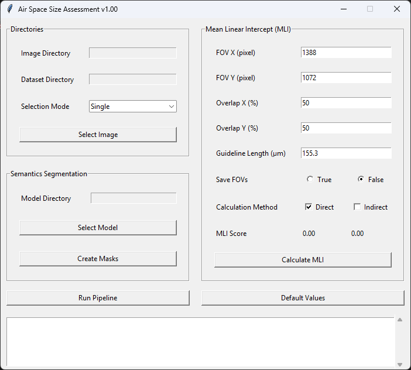

# End-To-End Automated Mean Linear Intercept Measurement System

[](https://www.python.org/downloads/release/python-390/)
[](https://www.anaconda.com/) 
[](https://www.tensorflow.org/) 
[](https://numpy.org/) 
[](https://pandas.pydata.org/) 

This repository hosts the implementation and resources for the automated Mean Linear Intercept (MLI) measurement system. The related paper has been submitted to the 47th Canadian Medical and Biological Engineering Society (CMBEC47) Conference and is currently under review.

The system is designed to calculate the MLI from histopathological images of lung tissue using a deep learning-based approach for semantic segmentation.


## Features
- **Automated MLI Measurement**:
  - Supports both **direct** and **indirect** methods.
  - Accurately segments lung structures such as alveoli, alveolar septa, blood vessels, and bronchi using a multiresolution convolutional neural network (CNN).
  - Evaluates thousands of field-of-view (FOV) images for robust MLI scoring.

- **Graphical User Interface (GUI)**:
  - Intuitive and user-friendly interface for parameter adjustment and batch processing.
  - Real-time feedback on progress and results.

- **Customizable Parameters**:
  - FOV size and stride.
  - Guideline length in µm.
  - Save FOVs and MLI method options.




## System Workflow

1. **Image Preprocessing**: Normalizes color variations to ensure consistent segmentation.
2. **Semantic Segmentation**: Identifies lung structures using a trained CNN model.
3. **Field-of-View Extraction**: Generates FOV images from WSIs using a sliding window approach.
4. **Field-of-View Screening**: Accepts or rejects FOVs based on specified criteria.
5. **MLI Measurement**: Calculates MLI using direct and/or indirect method.


## Requirements

The system uses avalible GPU for the semantic segmentation and CPU to compute the MLI score.
- **Anaconda Framework**: To manage the Python environment and dependencies.
- **Python**: Version 3.9.0
- **CUDA**: Version 11.2
- **cuDNN**: Version 8.1
- **TensorFlow**: Version 2.10
- **Required Python Packages**: Listed in `requirements.txt`


## Installation and Usage

1. Clone the repository:
   ```bash
   git clone https://github.com/atallahmadi/e2emli.git
   cd e2emli
   ```

2. Set up the [Python 3.9](https://www.python.org/) enviromnet:
   ```bash
   conda create --name MLI Python==3.9
   conda activate MLI
   ```

3. Install required dependencies:
   ```bash
   pip install -r requirements.txt
   ```

4. Launch the GUI:
   ```bash
   python app.py
   ```


## Citation

If you use this system, please cite the following paper:
> Atallah Madi, Adrian D.C. Chan. "End-To-End Automated Mean Linear Intercept Measurement System." *47th Canadian Medical and Biological Engineering Society Conference*. 2025.


## Acknowledgements

This project was supported by the Natural Sciences and Engineering Research Council of Canada (NSERC) and clinical collaborators at the University of Ottawa and the Ottawa Hospital Research Institute.


## Contact

For questions or collaboration inquiries, please contact:
- Atallah Madi - [atallah.madi@outlook.com](mailto:atallah.madi@outlook.com)
- Dr. Adrian D.C. Chan - [adrian.chan@carleton.ca](mailto:Adrian.Chan@carleton.ca)
